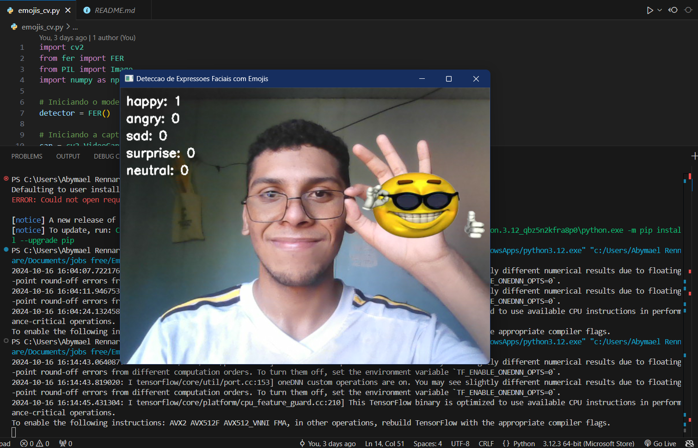
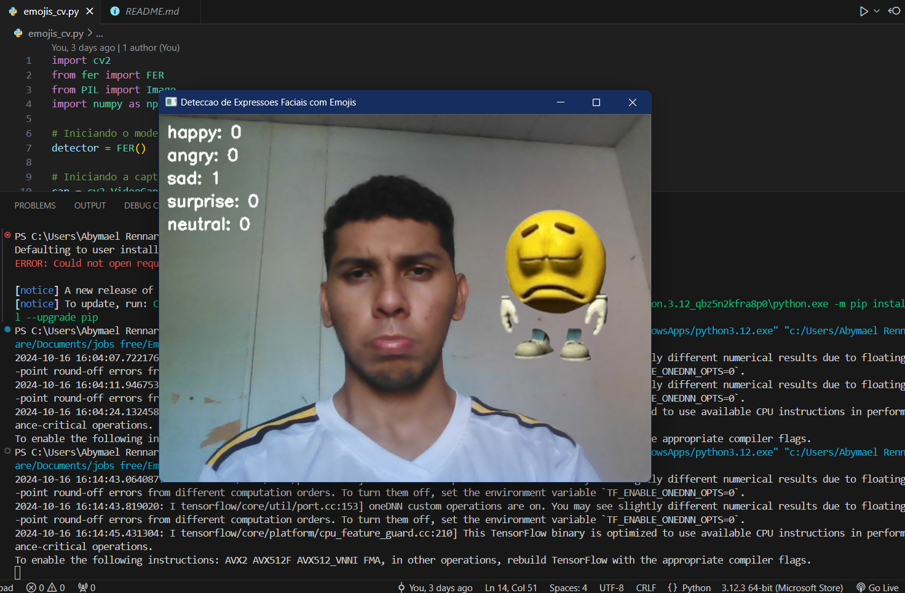
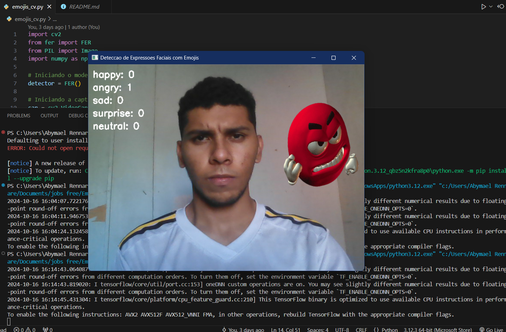

# Facial Expression Detection with Emojis 🎭😄

[](https://www.python.org/downloads/)
[](https://opensource.org/licenses/MIT)
[](https://opencv.org/)
[](https://pypi.org/project/fer/)

## 📋 Project Description

**English:**  
This project is a real-time facial expression detection system that recognizes emotions from a webcam feed and displays corresponding emojis next to each detected face. It uses `FER` for emotion recognition, `OpenCV` for video capture and image processing, and `Pillow` for emoji handling.

### Screenshots

<div style="display: flex; flex-wrap: wrap; gap: 10px; margin-left: 50px; margin-bottom: 20px">
  
  
  
  
  
</div>

- *Emotion Recognition Example*


## 🛠️ Prerequisites

- Python 3.7+
- Webcam

## 📦 Installation

### Clone the Repository

```bash
git clone https://github.com/abymael1895/facial-expression-detection.git
cd facial-expression-detection
```

### Install Dependencies 
*Install one at a time to avoid overloading bash*

```bash
pip install opencv-python
pip install opencv-contrib-python
pip install mediapipe
pip install tensorflow keras
pip install fer
pip install Pillow
``` 
## Steps to Enable Windows Long Path Support:
*If there are any installation errors*

- Open the Local Group Policy Editor:
- Press Win + R, type gpedit.msc, and press Enter.
- Navigate to the correct configuration:
- In the Local Group Policy Editor, navigate to: Computer Configuration -> Administrative Templates -> System -> File System.
- Enable long path support:
- Locate the Enable Win32 long paths option.
- Double-click on it and mark the Enabled option.
- Click OK.
- Restart your computer to apply the changes.
- Alternatively, you can enable long path support via the Windows Registry:
- Press Win + R, type regedit, and press Enter.
- Navigate to the following path: HKEY_LOCAL_MACHINE\SYSTEM\CurrentControlSet\Control\FileSystem.
- Locate the LongPathsEnabled key. If it doesn’t exist, create a new DWORD (32-bit) key.
- Set the value of LongPathsEnabled to 1.
- Restart your computer.

### How to Run 
Place emoji images in a folder called emojis/ in the project root directory with the following names: happy.png, angry.png, sad.png, surprise.png, neutral.png.

Then run:
```bash
python emojis_cv.py
```
Press Q to exit the window when running.

## 📄 License 
- This project is licensed under the MIT License - see the LICENSE file for details.
[](https://opensource.org/licenses/MIT)


## 📖 Documentation 
- [FER Documentation](https://pypi.org/project/fer/)
- [OpenCV Documentation](https://docs.opencv.org/)
- [Pillow Documentation](https://pillow.readthedocs.io/)


## 🤝 Contributing 
#### Gitflow Workflow
- Main Branch: Stable release version.
- Develop Branch: Latest development version.
- Feature Branches: Use for new features. Merge into develop when complete.
- Release Branches: Use for release preparation.
- Hotfix Branches: Use for critical fixes.

### How to Contribute 
- Fork this repository.
- Make your changes 
- Push to your forked repository 
- Open a pull request

```bash
git clone https://github.com/yourusername/facial-expression-detection.git
git checkout -b feature/your-feature-name
```

## 📧 Contact / Contato
- If you have any questions, feel free to open an issue or reach out at [rennare091@gmail.com].
- Se você tiver alguma dúvida, sinta-se à vontade para abrir uma issue ou entrar em contato em [rennare091@gmail.com].


- Thank you for checking out our project! We appreciate your contributions!
- Agradecemos por verificar nosso projeto! Apreciamos suas contribuições!

<div style=" margin-top: 90px; margin-bottom: 50px">  

# Português:  
Este projeto é um sistema de detecção de expressões faciais em tempo real que reconhece emoções a partir de uma captura de webcam e exibe emojis correspondentes ao lado de cada rosto detectado. Ele usa `FER` para reconhecimento de emoções, `OpenCV` para captura de vídeo e processamento de imagem, e `Pillow` para manipulação de emojis.
</div>

### Capturas de Tela


<div style="display: flex; flex-wrap: wrap; gap: 10px; margin-left: 50px; margin-bottom: 20px">
  
  
  
  
  
</div>


## 🛠️ Pre-requisitos

- Python 3.7+
- Webcam


## 📦 Instalação

### Clone o Repositório

```bash
git clone https://github.com/abymael1895/facial-expression-detection.git
cd facial-expression-detection
```

###  Instalar Dependências
*Instale uma de cada vez para evitar sobrecarregar o bash*

```bash
pip install opencv-python
pip install opencv-contrib-python
pip install mediapipe
pip install tensorflow keras
pip install fer
pip install Pillow
```

### Passos para habilitar Windows Long Path Support:
*Caso haja algum erro de instalação*
- Abrir o Editor de Política de Grupo Local:
- Pressione Win + R, digite gpedit.msc, e pressione Enter.
- Navegar até a configuração correta:
-  No editor de Política de Grupo Local, navegue até: Configuração do Computador -> Modelos Administrativos -> Sistema -> Sistema de Arquivos.
- Ativar o suporte a caminhos longos:
- Localize a configuração Ativar caminhos Win32 longos.
- Clique duas vezes nela e marque a opção Habilitado.
- Clique em OK.
- Reinicie o computador para que as alterações entrem em vigor.

### Alternativamente, você pode habilitar o suporte a caminhos longos via Registro do Windows:

- Pressione Win + R, digite regedit e pressione Enter.
- Navegue até o seguinte caminho: HKEY_LOCAL_MACHINE\SYSTEM\CurrentControlSet\Control\FileSystem.
- Localize a chave LongPathsEnabled. Se ela não existir, crie uma nova chave do tipo DWORD (32-bit).
- Defina o valor de LongPathsEnabled para 1.
- Reinicie o computador.

###  Como Executar
Português: Coloque imagens de emojis em uma pasta chamada emojis/ no diretório raiz do projeto com os seguintes nomes: happy.png, angry.png, sad.png, surprise.png, neutral.png.

Em seguida, execute:
```bash
python emojis_cv.py
```
Pressione Q para sair da janela ao executar

## 📄 Licença
- Este projeto está licenciado sob a Licença MIT - veja o arquivo LICENSE para detalhes.
[](https://opensource.org/licenses/MIT)


## 📖  Documentação
- [FER Documentation](https://pypi.org/project/fer/)
- [OpenCV Documentation](https://docs.opencv.org/)
- [Pillow Documentation](https://pillow.readthedocs.io/)


## 🤝 Contribuição
#### Gitflow Workflow
Branch Principal: Versão estável de lançamento.
Branch de Desenvolvimento: Versão mais recente em desenvolvimento.
Branches de Funcionalidade: Usadas para novas funcionalidades. Mesclar na branch de desenvolvimento quando concluído.
Branches de Lançamento: Usadas para preparação de lançamento.
Branches de Correção Rápida: Usadas para correções críticas.

###  Como Contribuir
-  Faça um fork deste repositório.
-  Faça suas alterações
-  Envie para seu repositório forkado
-  Abra um pull request

```bash
git clone https://github.com/yourusername/facial-expression-detection.git
git checkout -b feature/your-feature-name
```

*@copyright Abymael Rennare 2024*
